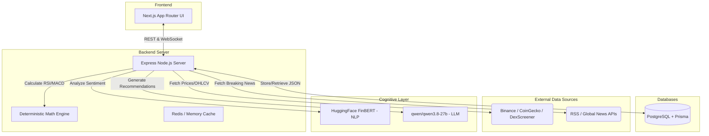
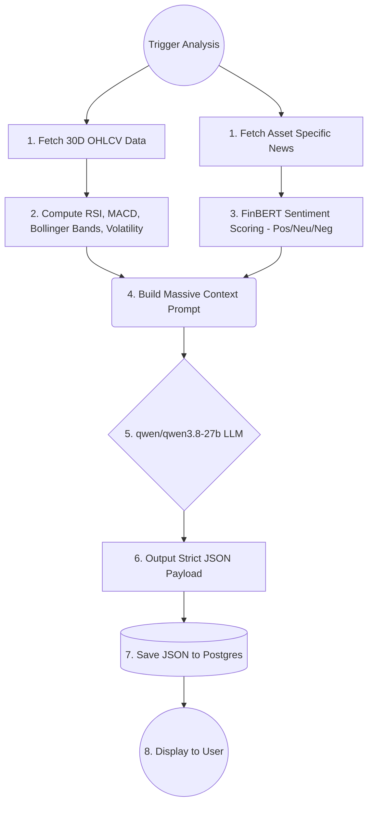

# Beacon (formerly known as FinPilot) 🚀

Beacon (formerly known as FinPilot) is an advanced, AI-driven portfolio management and market intelligence dashboard. It transcends basic price tracking by deploying a multi-model cognitive engine to synthesize technical market conditions, parse natural language news, run historical DCA simulations, and provide highly opinionated, data-backed trading recommendations.

---

## 🏗️ System Design & Architecture

Beacon operates on a decoupled client-server architecture designed for high-frequency data ingestion and complex LLM orchestration. 

### Core Tech Stack

*   **Frontend**: Next.js 14 (App Router), Tailwind CSS, Lucide-React, Recharts.
*   **Backend**: Node.js, Express, WebSocket (for live news).
*   **Database**: PostgreSQL managed via Prisma ORM.
*   **AI / Machine Learning**: 
    *   **LLM Engine**: qwen/qwen3.8-27b for cognitive synthesis.
    *   **NLP Engine**: HuggingFace FinBERT for financial news sentiment analysis.

### High-Level Architecture Diagram


```mermaid
graph TD
    subgraph Frontend
        Client[Next.js App Router UI]
    end

    subgraph Backend Server
        Server[Express Node.js Server]
        MathEngine[Deterministic Math Engine]
        Cache[Redis / Memory Cache]
    end

    subgraph Databases
        DB[(PostgreSQL + Prisma)]
    end

    subgraph External Data Sources
        MarketAPIs(Binance / CoinGecko / DexScreener)
        RSSFeed(RSS / Global News APIs)
    end

    subgraph Cognitive Layer
        FinBERT[HuggingFace FinBERT - NLP]
        Qwen[qwen/qwen3.8-27b - LLM]
    end

    Client <-->|REST & WebSocket| Server
    Server <-->|Store/Retrieve JSON| DB
    Server -->|Fetch Prices/OHLCV| MarketAPIs
    Server -->|Fetch Breaking News| RSSFeed
    Server -->|Calculate RSI/MACD| MathEngine
    Server -->|Analyze Sentiment| FinBERT
    Server -->|Generate Recommendations| Qwen
```

---

## 🧠 The AI Cognitive Engine (RAG Pipeline)

Beacon’s Recommendation Engine doesn’t just guess or hallucinate. It relies on a rigorous **Retrieval-Augmented Generation (RAG)** pipeline tailored specifically for quantitative finance.

### Pipeline Flowchart


```mermaid
flowchart TD
    Start((Trigger Analysis)) --> FetchPrice[1. Fetch 30D OHLCV Data]
    Start --> FetchNews[1. Fetch Asset Specific News]
    
    FetchPrice --> MathNode[2. Compute RSI, MACD, Bollinger Bands, Volatility]
    FetchNews --> NLPNode[3. FinBERT Sentiment Scoring - Pos/Neu/Neg]
    
    MathNode --> Context(4. Build Massive Context Prompt)
    NLPNode --> Context
    
    Context --> LLM{5. qwen/qwen3.8-27b LLM}
    
    LLM --> JSONParse[6. Output Strict JSON Payload]
    JSONParse --> DB[(7. Save JSON to Postgres)]
    DB --> UI((8. Display to User))
```

### The 4 Phases:
1.  **Data Ingestion**: Queries external APIs for exact 30-day OHLCV data, global market cap, and recent news articles.
2.  **Deterministic Math Layer**: Computes exact technical indicators (RSI, MACD, BB) server-side. This ensures the LLM is fed *factual* mathematical data rather than hallucinating calculations.
3.  **NLP Sentiment Analysis**: Feeds the news titles/descriptions into FinBERT to get a weighted sentiment score (-1 to 1).
4.  **LLM Synthesis**: Formats the technicals and sentiment into a large prompt, forcing the LLM to output a strict JSON schema containing a 7-day price target, a `BUY/SELL/HOLD` action, and an array of bulleted reasoning.

---

## ⚡ Core Features

### 1. Market Dashboard & Portfolio
Tracks user-entered asset holdings, calculating real-time P/L by diffing current prices against Postgres buying prices. Visualizes total portfolio value, 24h market volume, and an active **Fear & Greed Index** gauge.

### 2. Global News Stream
Listens to a live WebSocket for breaking global news. Automatically calculates the macro sentiment split (Positive vs Neutral vs Negative) of the overall market using FinBERT. Includes an interactive AI summary tool.

### 3. AI Recommendations
Displays the results of the RAG pipeline. Shows advanced indicators (MACD line, signal, histogram, Bollinger Band bounds, 7D Moving Average, Volatility) and the AI's exact reasoning bullets alongside an action conviction score.

### 4. Derivatives & Liquidation Tracker
Queries Futures APIs for **Funding Rates**, **Open Interest**, and **Long/Short Ratios**. Calculates a proprietary "Liquidation Heat" score to warn users of impending long or short squeezes caused by over-leveraging.

### 5. India Crypto Hub
A localized arbitrage and tax tool for Indian users. 
*   **Premium Tracker**: Measures the "India Premium" gap between global implied USD rates and local INR exchange prices (CoinDCX, WazirX).
*   **Tax Calculator**: A tax-aware sell preview that automatically subtracts India's flat 30% crypto tax (with no loss offsets) and 1% TDS, yielding the exact net INR expected.

### 6. DCA Simulator
Allows users to backtest Dollar Cost Averaging strategies. Queries historical market data, calculates exact buy points based on daily/weekly/monthly intervals, and renders a precise Recharts AreaChart comparing 'Total Invested' to 'Actual Portfolio Value'.

---

## 💾 Database Schema (JSONB Advantage)

Beacon utilizes PostgreSQL's `JSON/JSONB` column typing via Prisma to elegantly handle unstructured LLM outputs. 

```prisma
model PortfolioAnalysis {
  id             String    @id @default(uuid())
  portfolioId    String
  portfolio      Portfolio @relation(fields: [portfolioId], references: [id], onDelete: Cascade)
  
  data           Json      // Contains full AI Recommendation JSON
  createdAt      DateTime  @default(now())
}
```

This ensures that if the LLM prompt is updated to return new indicators (e.g., adding a new moving average or on-chain metric), the database doesn't require rigorous schema migrations. Everything returned by the AI is perfectly preserved exactly as generated.

---

## 🚀 Getting Started

### Prerequisites
*   Node.js v18+
*   PostgreSQL running locally or via Docker
*   API Keys: OpenRouter or equivalent for qwen3.8-27b, HuggingFace (FinBERT - optional, fallback available)

### Installation

1.  **Clone the repository**
2.  **Setup Backend**
    ```bash
    cd backend
    npm install
    # Setup .env with DATABASE_URL, QWEN_API_KEY, etc.
    npx prisma db push
    npm run dev
    ```
3.  **Setup Frontend**
    ```bash
    cd frontend
    npm install
    # Setup .env.local if needed
    npm run dev
    ```
4.  Navigate to `http://localhost:3000` to view the Beacon Dashboard.
